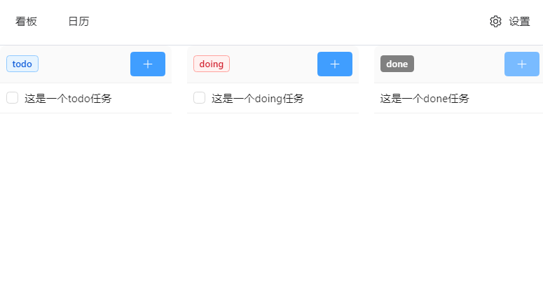
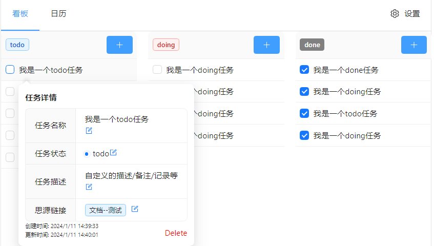
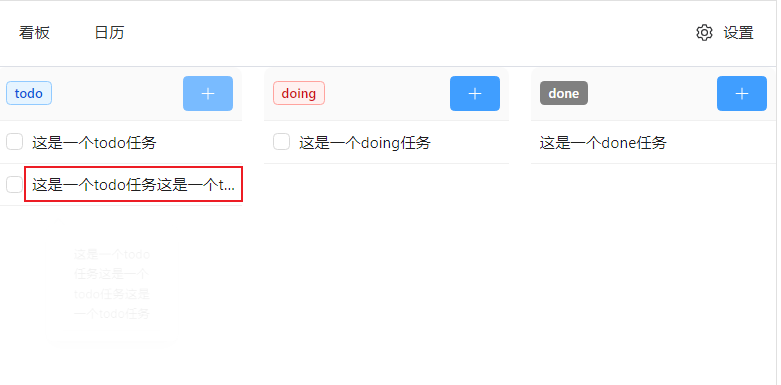
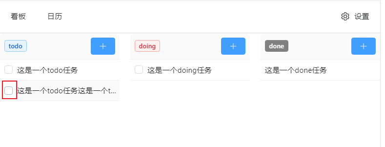
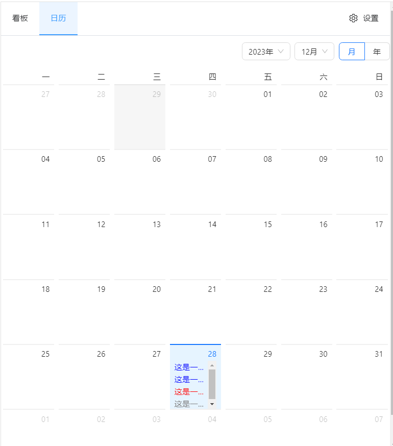
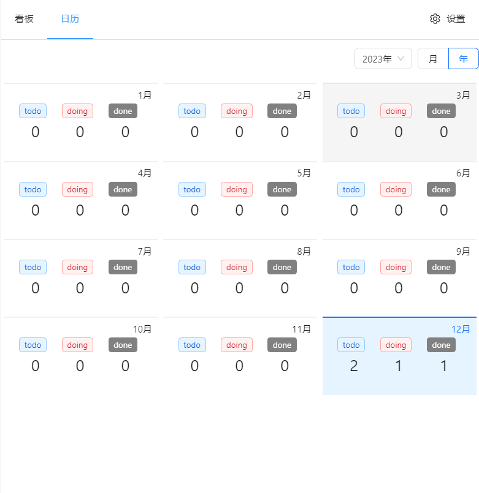
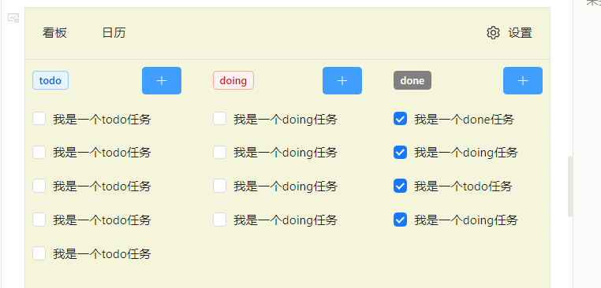

 [English](README.md) 

# SimplePlan

## 开始

SimplePlan是用于记录待办任务的一款挂件，开发的原因主要是想有日历视图。

* 该挂件的任务分为三类：待做任务（todo），正在进行的任务（doing），已经做完的任务（done）
* 每个任务都有自己的一些属性（名称、描述、时间等）
* 通过看板视图和日历视图都能查看任务
* 任务数据存放在块的属性中，所以千万别删除块。后面会增加导出功能。

目的是想做一个待办任务/清单，可以和siyuan深度融合的挂件（插件，看后面支不支持）。

有问题或建议可以提Issues(https://github.com/ScottXjw/SimplePlan/issues)，我会尽快更新。

## 预览

### 看板视图

鼠标移动到任务上，会出现视图

单击任务会出现详细描述，点击编辑按钮可以编辑具体字段

文本长度超过一定数值会省略

点击任务前面的选择框，会直接修改任务状态到done

### 日历视图

# 更新历史

## v0.1.1

1. 修复了已知的bug（在此特别感谢用户**[pisceswb](https://github.com/pisceswb)**）

2. 新增功能

   - 新增思源链接字段，可以搜索思源笔记中的**文档名**和**标题**，添加到任务中。
   - 新增任务视图支持 使用Enter快捷键 激活Create按钮

3. 页面修改

   具体如下图，看板视图调整为透明

   

## v0.1.0

**提前祝大家元旦快乐**！！！！！！

新增功能：

1. 给待办任务加✅选择框 
2. 同类型任务支持拖动排序
3. 增加日历年视图，汇总
4. 增加悬浮视图

已有功能修改

1. 修改任务tag的颜色
2. 修改日历视图样式

## v0.0.8

修复已知的bug

### todo功能

- [ ] 给待办任务加✅选择框  from 用户**[pisceswb](https://github.com/pisceswb)**
- [ ] 同类型任务支持拖动 from 用户**[qq79248314](https://github.com/qq79248314)**

## v0.0.7

新增删除按钮

## v0.0.6

修复了button文本超出长度之后显示的问题
