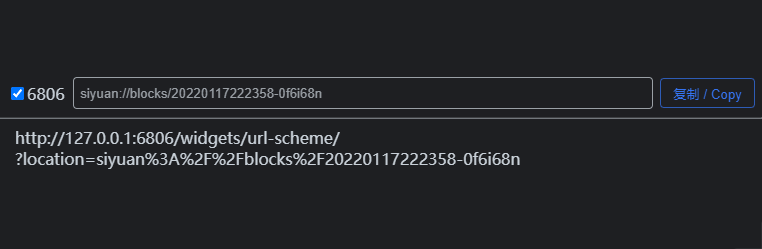

---

---
[简体中文](./README_zh_CN.md) \| English

---

# URL Scheme

> This project forked from [DiamondYuan/302](https://github.com/DiamondYuan/302) *[MIT License](https://github.com/DiamondYuan/302/blob/main/LICENSE)*, thanks to the original author [DiamondYuan](https://github.com/DiamondYuan) :heart:.

A widget that converts the URL Scheme to HTTP 302 redirection.

## PREVIEW

## FUNCTION

- Convert `URL Scheme` to `HTTP URL`.
  - After entering the `URL Scheme`, click the <kbd>Copy</kbd> button to write the converted `HTTP URL` to the clipboard.
  - After entering the `URL Scheme` and click <kbd>Enter</kbd> key to write the converted `HTTP URL` to the clipboard.
- Redirect `HTTP URL` to `URL Scheme`.
  - Redirect to `URL Scheme` when accessing `HTTP URL` in the browser.
- Follow the global theme to change the color.
- Automatically close the tab after the jump is completed.
- Tick the `6806` checkbox to set the hyperlink's port to port 6806.
  - The SiYuan kernel listens on port `6806` at the same time when using a random port number.

## START

### AUTO

The widget has been put on the shelves at [SiYuan community bazaar](https://github.com/siyuan-note/bazaar) and can be installed directly in the Bazaar.

### MANUAL

1. Download the release package in [Releases](https://github.com/Zuoqiu-Yingyi/widget-url-scheme/releases), unzip it and place it in the `<workspace>/data/widgets/` directory of [SiYuan Note](https://github.com/siyuan-note/siyuan).
2. Create an `IFrame` block in your notes with the address filled in `/widgets/widget-url-scheme`.

## CHANGE LOG

[CHANGE LOG](./CHANGELOG.md)
